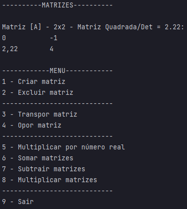

# Calculadora De Matrizes

Uma calculadora de operações entre matrizes, feita somente com a finalidade de treinamento em java.

***

## Como funciona?

***

### 0. Matrizes

Lista de matrizes salvas;

A matriz é demonstrada na seguinte estrutura:

Matriz [*Nome*] - *Tamanho* - *Tipo quando ao tamanho e/ou quanto aos elementos*:

*Elementos da matriz*

***

### 1. Criar matriz

Opção para criação de matriz.

Após informar o nome, número de linhas, número de colunas e elementos, o usuário deverá informar se deseja que a matriz seja salva.

OBS: Uso de espaço não permitido em nomes.
OBS2: Recomenda-se o uso de somente um char em nomes.

***

### 2. Excluir matriz

Opção para realizar a exclusão de uma matriz de sua lista.

Após informar o nome da matriz, ela será excluída.

***

### 3. Transpor matriz

Opção para obter a matriz transposta da matriz desejada.

Após informar o nome da matriz, o usuário deverá informar se deseja que a matriz resultante seja salva.

***

### 4. Opor matriz

Opção para obter a matriz oposta da matriz desejada.

Após informar o nome da matriz, o usuário deverá informar se deseja que a matriz resultante seja salva.

***

### 5. Multiplicar matriz por número real

Opção para realizar o cálculo de uma matriz por um número real.

Após informar o nome da matriz e o número real, o usuário deverá informar se deseja que a matriz resultante seja salva.

***

### 6. Somar matrizes

Opção para realizar a soma entre duas matrizes.

Após informar o nome da primeira e da segunda matriz, o usuário deverá informar se deseja que a matriz resultante seja salva.

***

### 7. Subtrair matrizes

Opção para realizar a subtração entre duas matrizes.

Após informar o nome da primeira e da segunda matriz, o usuário deverá informar se deseja que a matriz resultante seja salva.

***

### 8. Multiplicar matrizes

Opção para realizar a multiplicação entre duas matrizes.

Após informar o nome da primeira e da segunda matriz, o usuário deverá informar se deseja que a matriz resultante seja salva.

***

### 9. Sair

Opção para fechar programa.
